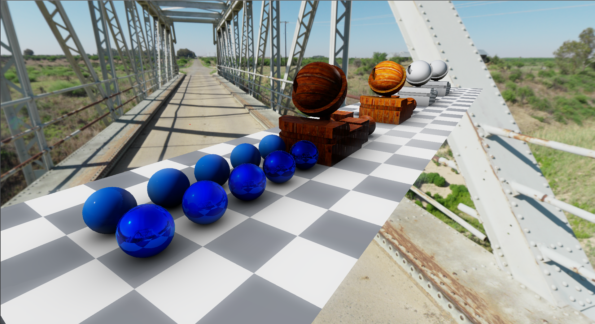
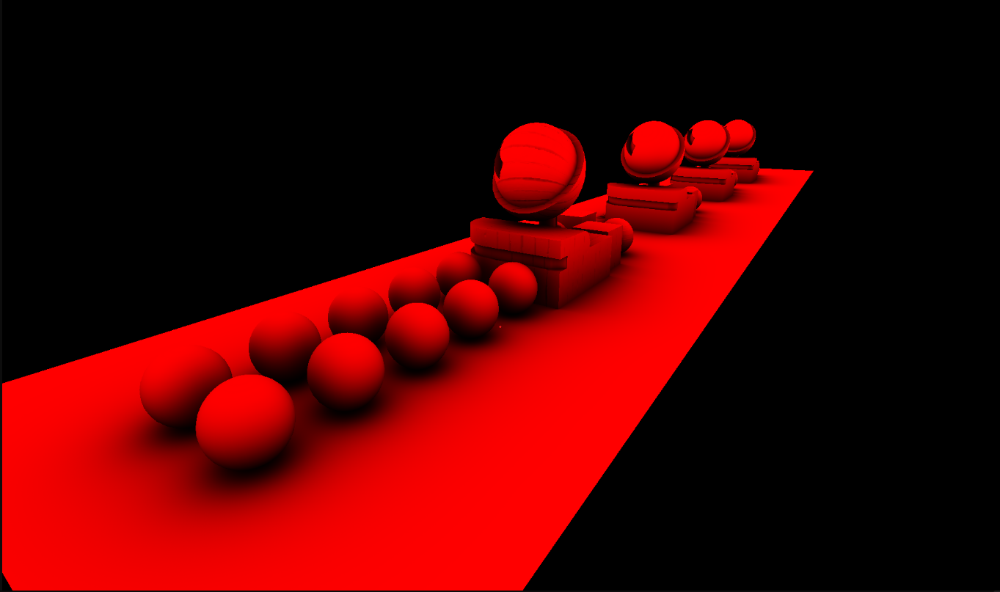
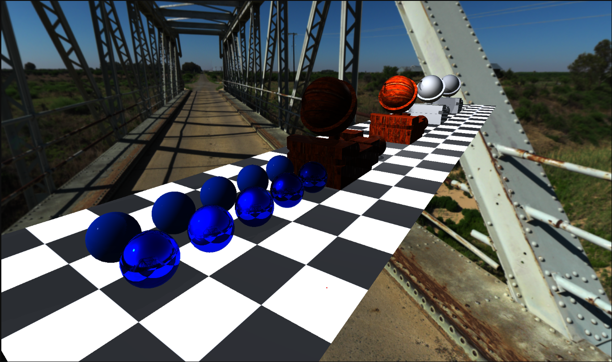
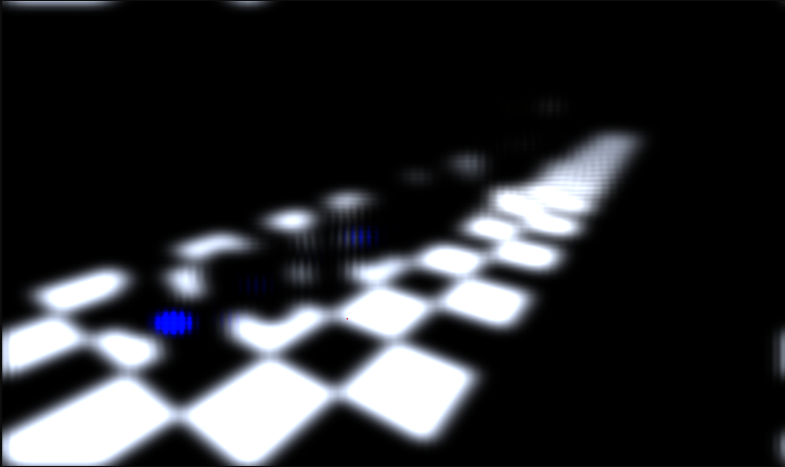
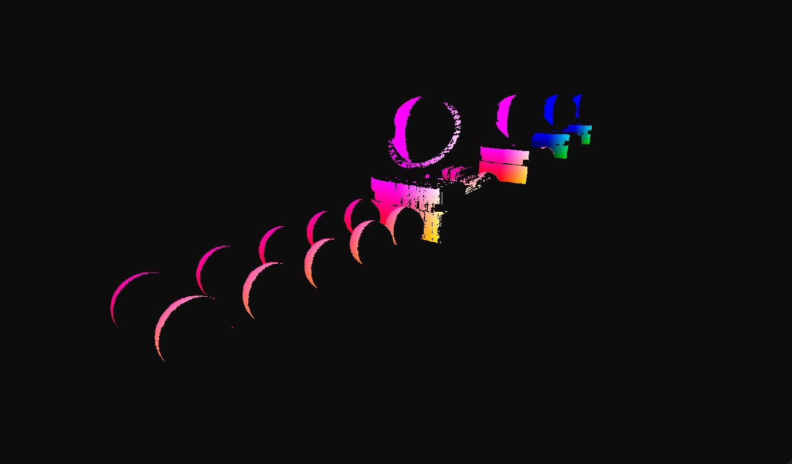
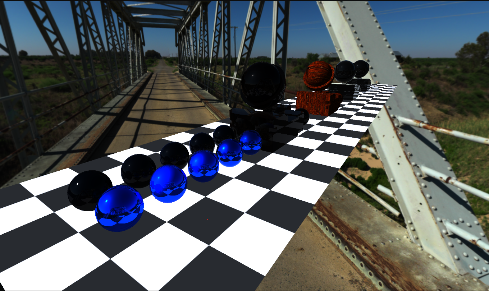
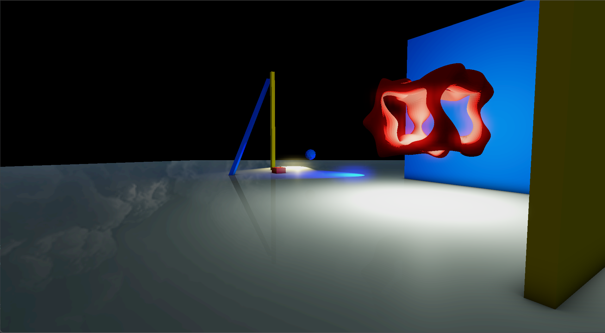
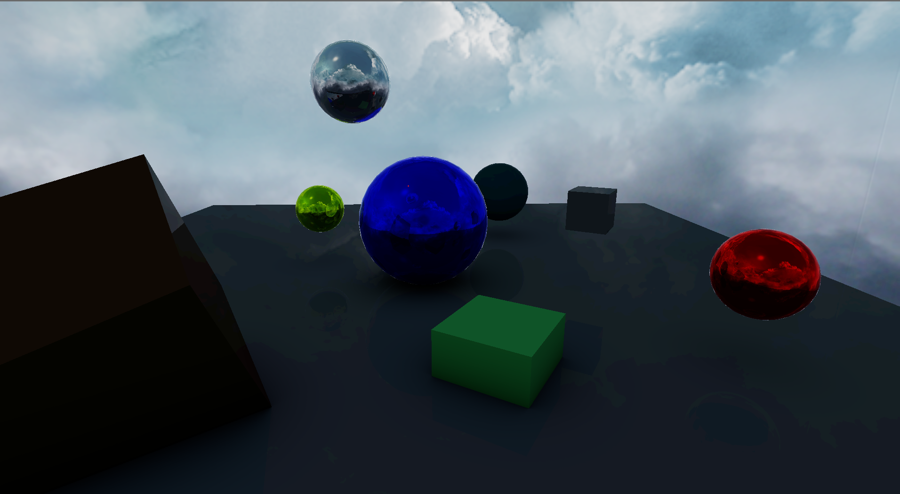
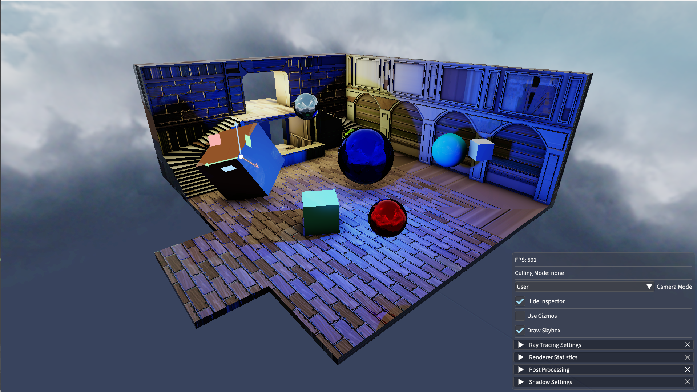

# Noire Engine 2: A Realtime Hybrid Rendering Engine in Vulkan and C++20
Noire Engine 2 supports a Forward+ rasterization pipeline, carrying a small compressed G-buffer, into a RTX-powered realtime ray tracing pipeline.

## Core Features
- Ray Traced Reflections
- Compute-driven Ray Traced Ambience Occlusion
- Physically-Based Rendering
- Image-Based Lighting
- Parallax Occlusion Mapping
- Analytical Lights: Directional, Spot, Point
- Multi-threaded Shadow Mapping
- Percentage-Closer Soft Shadows
- Cascaded Shadow Maps
- Omni-directional Shadow Maps
- ImGui-based UI and Scene Hierarchy
- Entity-Component System
- Physically-Based Bloom

## Upcoming Features
- Tile-based Clustered Light Culling
- Compute-based Culling and Depth Pyramids

## Showcase

    
    <em>AO Map</em>

    
    <em>Direct Lighting and Color Map</em>

    
    <em>Emission Map</em>

    
    <em>Compressed G Buffer</em>

    
    <em>Reflection Map (Lambertian Materials are not reflective)</em>

