# Noire Engine 2: A Realtime Hybrid Rendering Engine in Vulkan and C++20

Noire Engine 2 supports a Forward+ rasterization pipeline, carrying a small compressed G-buffer, into a RTX-powered realtime ray tracing pipeline.

## Final Project Features
- Ray Traced Reflections
- Compute-driven Ray Traced Ambience Occlusion
- Physically Based Bloom

## Architecture
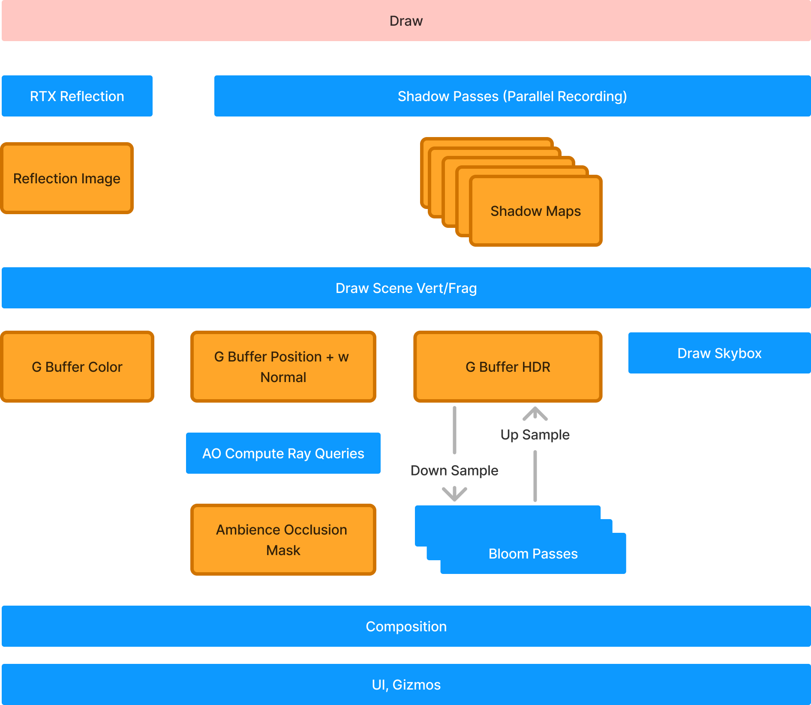 

## Ray Traced Reflections
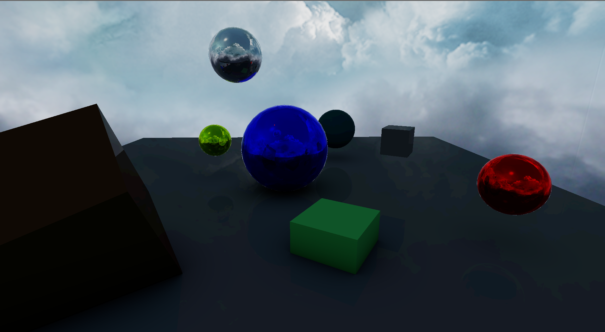 
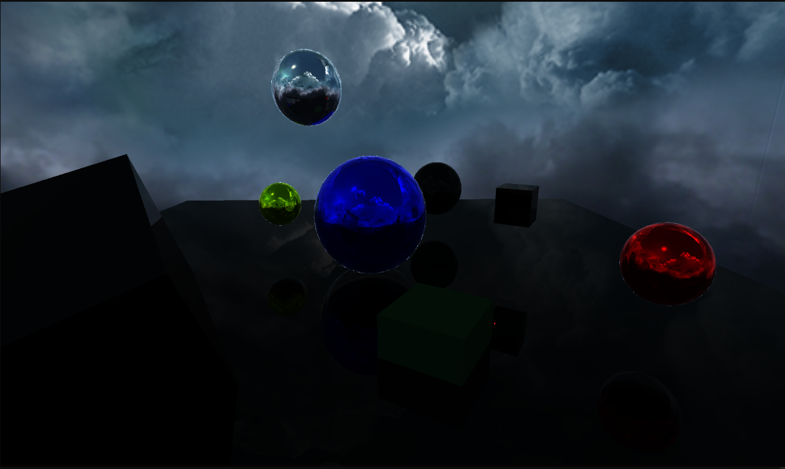
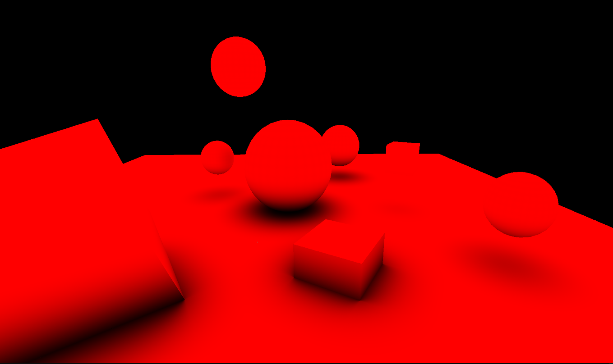

## Compute-driven Ray Traced Ambience Occlusion
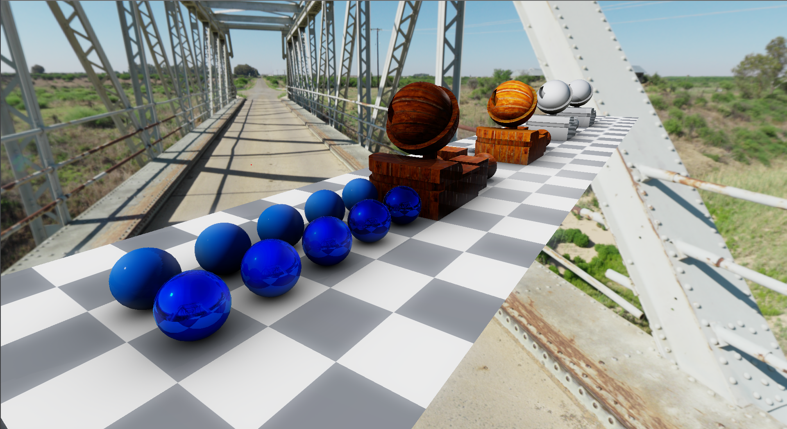 
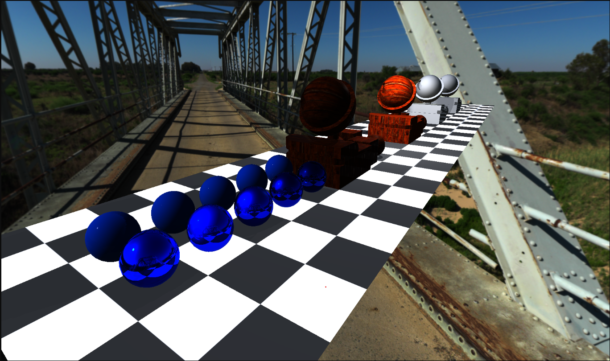
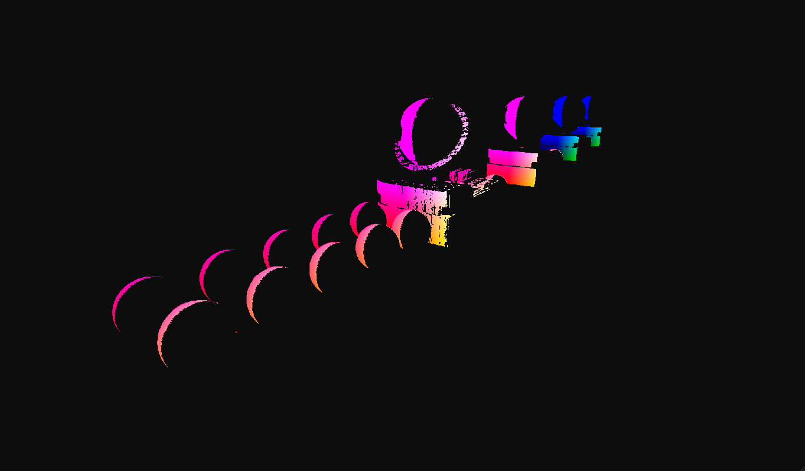
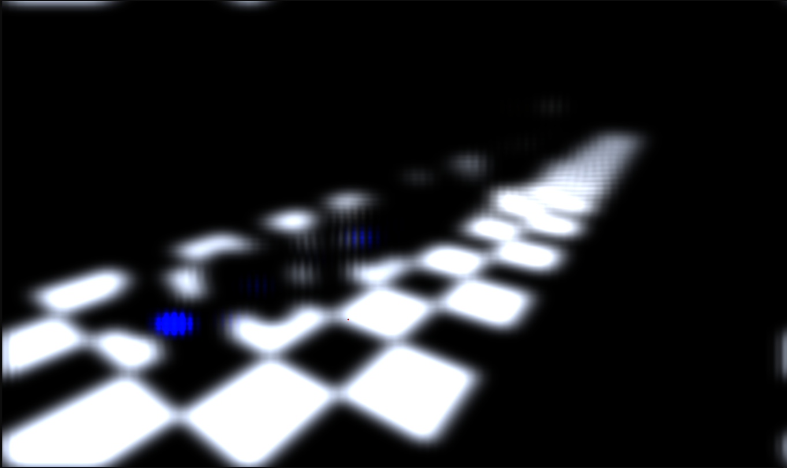
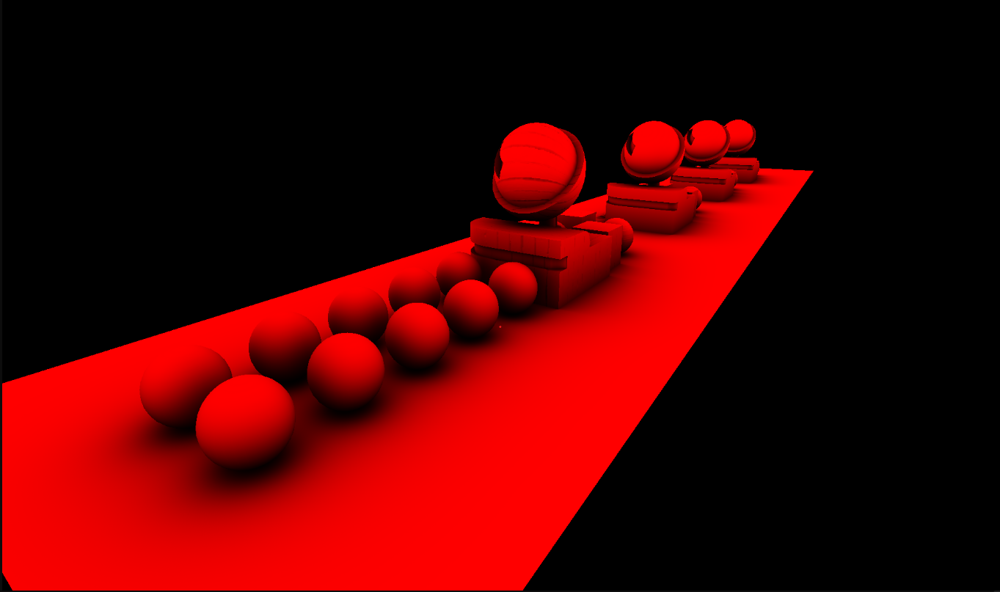
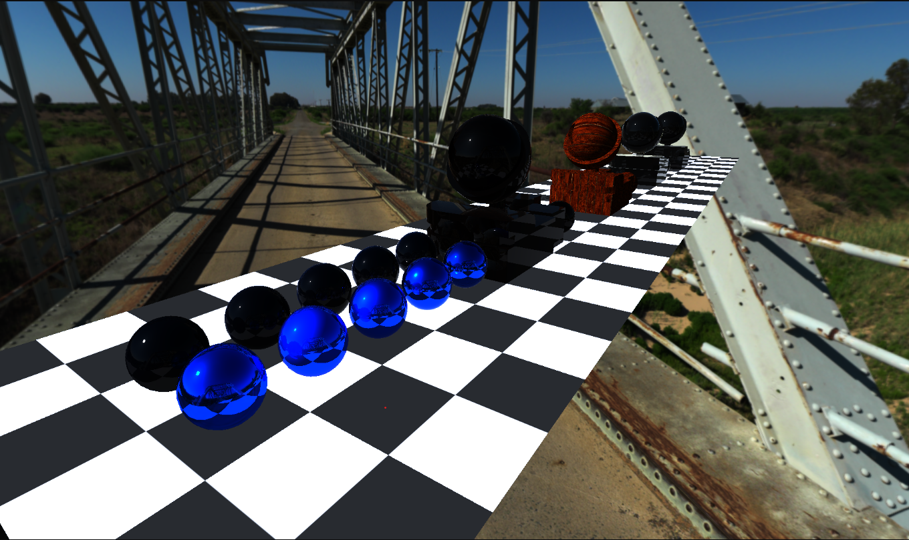

## Physically Based Bloom

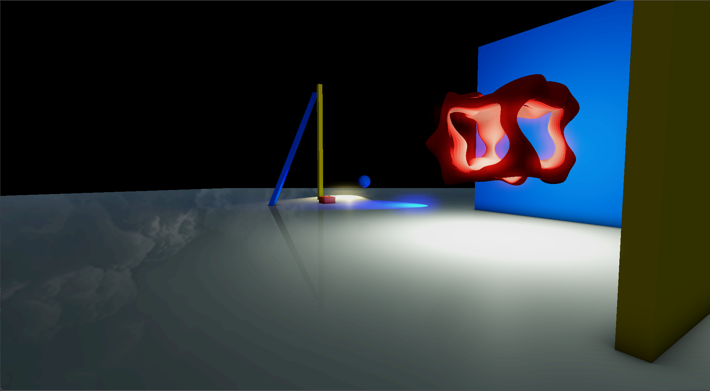 

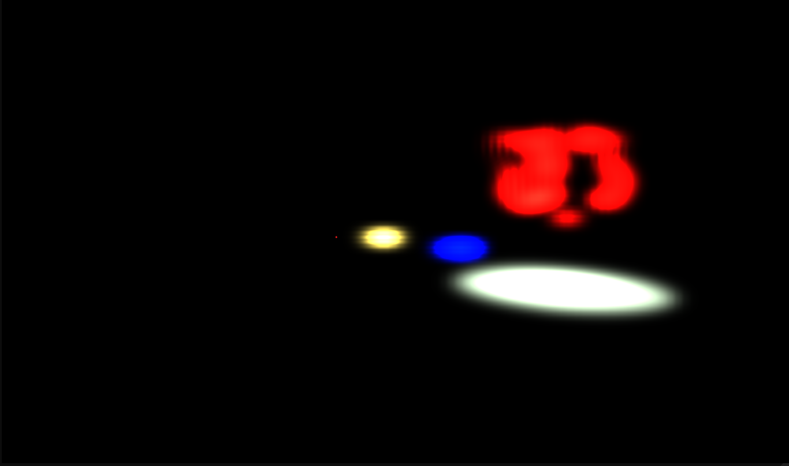
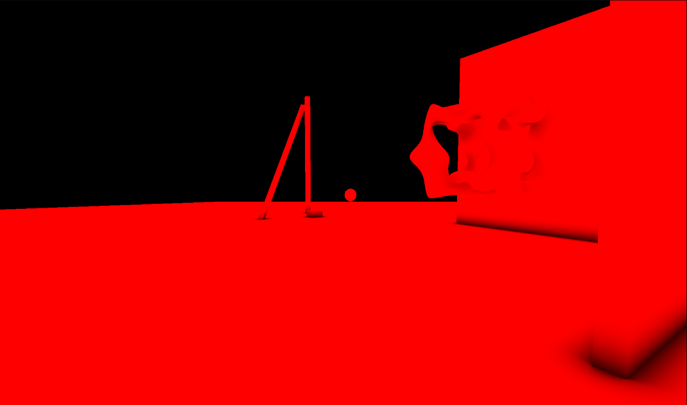